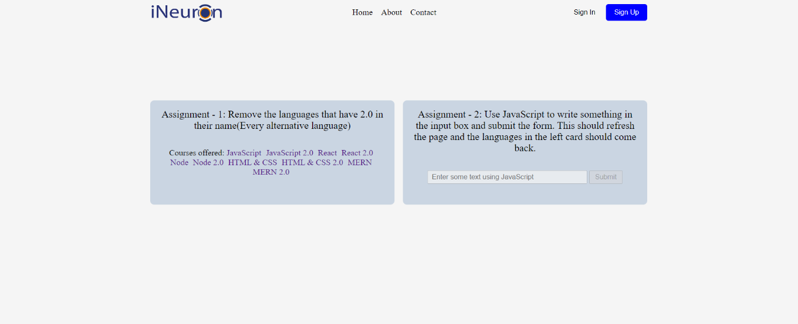
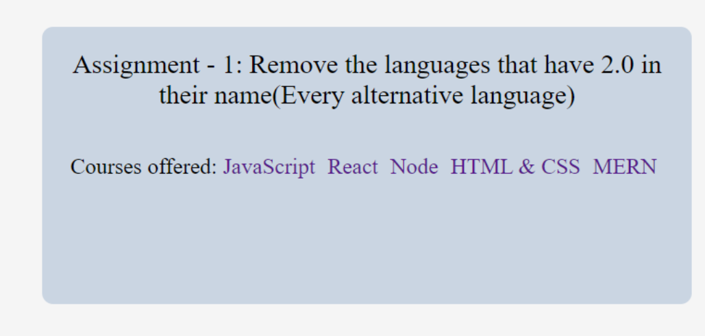

# Question 7
## Main Preview

# Task
### Remove the languages that have 2.0 in their name and Use JavaScript to write something in the input box and submit the form. This should refresh the page and the languages in the left card should come back.

// Removing the languages that have 2.0 in their name

let removeLang = document.querySelectorAll(".main__languages a");

for (let i = 0; i < removeLang.length; i++) {
  if (removeLang[i].innerText.includes("2.0")) {
    removeLang[i].style.display = "none";
  }
}

// Enable button and Input field

let inputField = document.querySelector(".main__form-input");
inputField.disabled = false;

let submitBtn = document.querySelector(".main__form-btn");
submitBtn.disabled = false;

// Adding a eventlistener in submit button

submitBtn.addEventListener("click", click);
function click() {
  for (let i = 0; i < removeLang.length; i++) {
    removeLang[i].style.display = "inline-block";
  }
}
